# Trazado de una vulnerabilidad

En esta práctica vamos a realizar el trazado de la vulnerabilidad que se trata en [Este articulo](https://www.incibe.es/empresas/avisos/vulnerabilidad-critica-de-omision-de-autenticacion-en-goanywhere-mft-de-fortra)

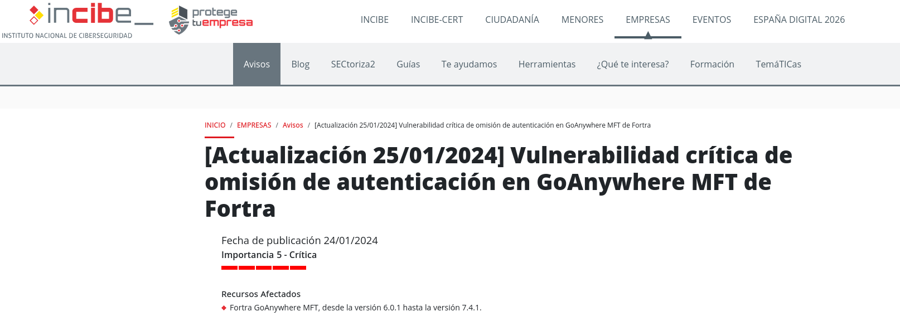

## Indice

> 1.[Información en CVE.org](#1-información-en-cveorg)
>
> 2.[Información en CWE.MITRE.org](#2-información-en-cwemitre.org)
>
> 3.[Patrón de ataque](#3-patrón-de-ataque)
>
> 4.[Criticidad de la vulnerabilidad ](#4-criticidad-de-la-vulnerabilidad)
----

Antes comenzar si revisamos la página del articulo, contiene un apartado con un listado de referencias y un enlace que nos lleva a la página cuyo software contiene la vulnerabilidad y que nos explica de manera mas detallada la vulnerabilidad, esa página es **FORTRA**, es una empresa que ofrece software para soluciones de ciberseguridad y automatización de procesos complejos de TI.

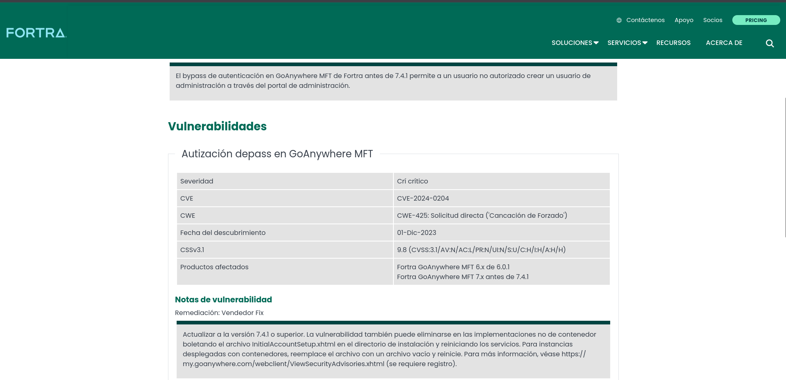

## 1. Información en [CVE.org](https://www.cve.org/CVERecord?id=CVE-2024-0204)

En la página de CVE.org nos da mas información de la vulnerabilidad, nos indica que la omisión de autenticación en el producto **GoAnywhere MFT** de Fortra en la versión anterior a la 7.4.1 permite a cualquier usuario no autorizado crear un usuario administrador a traves del portal de administración.

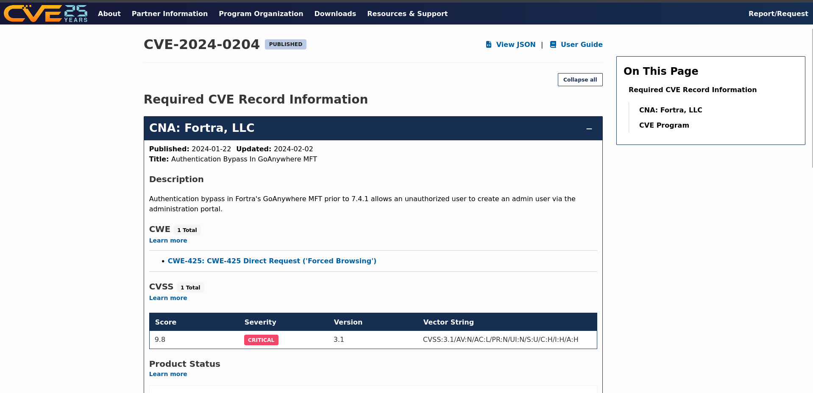

También nos da un enlace a la página de CWE.MITRE.org y otro detalles como la criticidad de la vulnerabilidad y referencias:

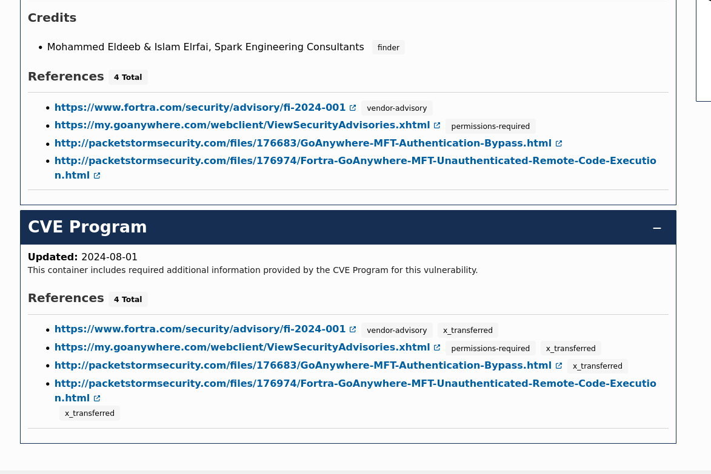

----

## 2. Información en [CWE.MITRE.org](https://cwe.mitre.org/data/definitions/425.html)

En la página de CWE.MITRE.org podemos ver información sobre las debilidades, nos indica que la aplicación no aplica correctamente la autorización apropiada en todas las urls o archivos restringidos, también nos indica que esa debilidad afecta a la Confidencialidad, Integridad, Disponiblilidad y Control de acceso.

También nos ofrece posibles mitigaciones, por ejemplo, aplicando autorizaciones de control de acceso adecuadas para acceso a todas la urls o archivos restringidos, tambien indica utilizar marcos basados en **MVC** (Modelo Vista Controlador). Ademas ofrece una tabla con las relaciones que tiene esta debilidad con otras, vemos que es hija de otras, entre ellas una que es 'Omisión de autenticación mediante una ruta o canal alternativo' y precede a otras debilidades como la de 'Modificación de datos supuestamente inmutables (MAID)'.

Incluso nos incluye un ejemplo demostrativo y unas referencias a patrones de ataque relacionados:

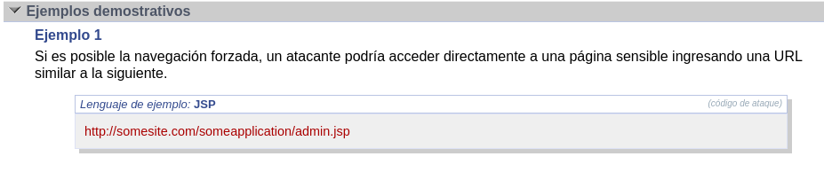

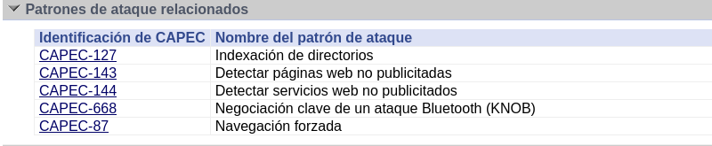

----

## 3. Patrón de ataque

Para consultar el patrón de ataque acudimos a la página de **capec.mitre.org**, esta página nos indica que un atacante utiliza una navegación forzada (entrada directa de URL) para acceder a partes de un sitio web que de otro modo serían inaccesibles. También ofrece relaciones con otros patrones de ataque:

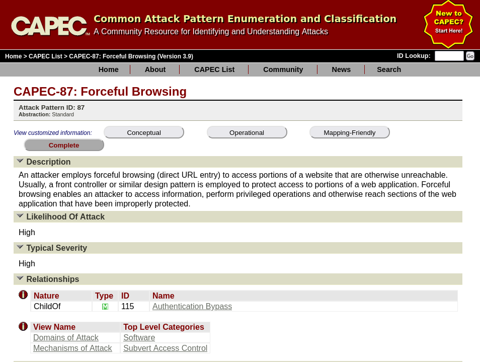

También tenemos un flujo de ejecución del ataque:

El primer paso consiste en descubrir directorios del servidor y revisarlos, después la explotación consistiría en detectar algun directorio que no esté destinado a la vista pública para acceder a el y poder leerlos:

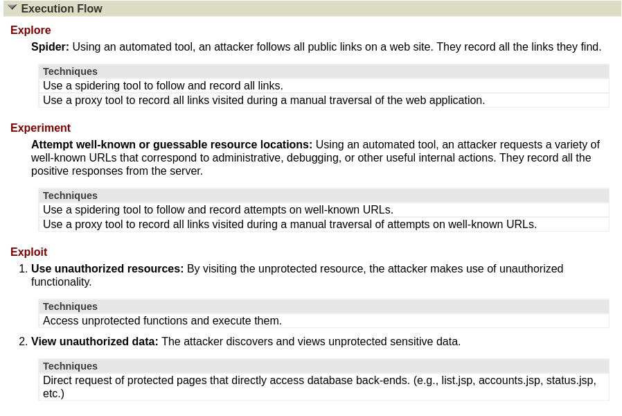

Las habilidades requeridas para hacer una ataque a esa vulnerabilidad por un lado son bajas para emitir la solicitud a la url sin proporcionar nombre de archivo específico y por otro lado alta para evitar el control de acceso al directorio de listados. Una consecuencia de esto en que vulnera la confidencialidad ya que es posible leer datos que no deberian estar públicos. Además ofrece posibles mitigaciones, ejemplos de casos y debilidades relacionadas que se muestran en la imagen:

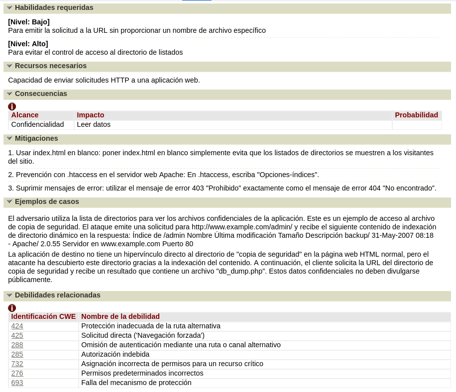

----

## 4. Criticidad de la vulnerabilidad

La página de **CVE.org** ya nos proporciona una pequeña tabla indicando la puntuación de criticidad de esa vulnerabilidad, **9.8 (HIGH)** obtiene de puntuación:

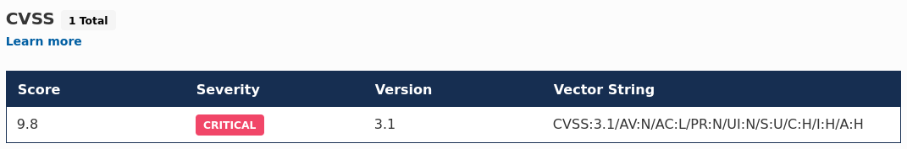

Para obtener mas información del porque de esa puntuación podemos dirigirnos a la página de **NVD.NIST.gov** donde podemos ver cada una de las métricas que se calculan para obtener la puntuación dependiendo de la versión:

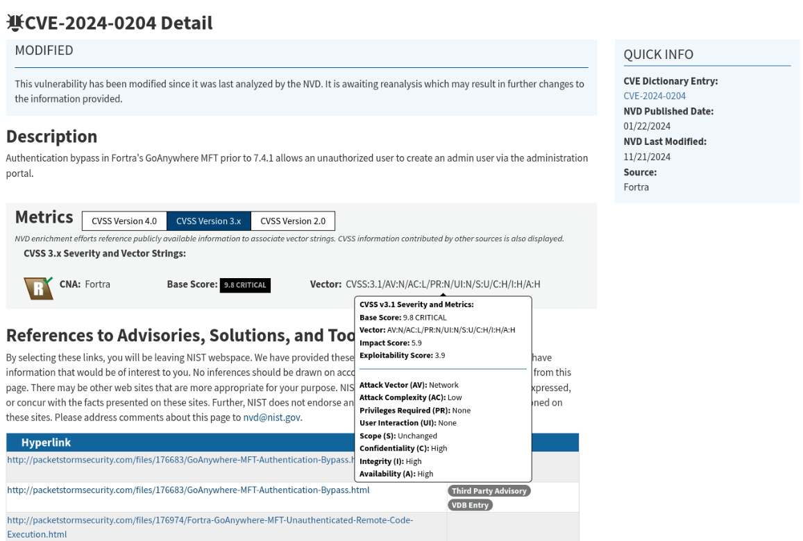

Vemos que el vector de ataque es en la red, la complejidad del ataque es baja, no requiere permisos elevados, tampoco requiere interacción del usuario y el alcance es en la maquina donde se realiza en ataque.
